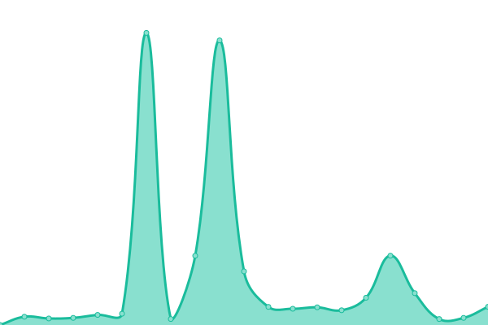

# [📈 Live Status](https://upptime.github.io/upptime): <!--live status--> **🟩 All systems operational**

This repository contains the open-source uptime monitor and status page for [Upptime](https://upptime.js.org), powered by [Upptime](https://github.com/upptime/upptime).

With [Upptime](https://upptime.js.org), you can get your own unlimited and free uptime monitor and status page, powered entirely by a GitHub repository. We use [Issues](https://github.com/upptime/upptime/issues) as incident reports, [Actions](https://github.com/user9592844/upptime-test/actions) as uptime monitors, and [Pages](https://upptime.github.io/upptime) for the status page.

<!--start: status pages-->
<!-- This summary is generated by Upptime (https://github.com/upptime/upptime) -->
<!-- Do not edit this manually, your changes will be overwritten -->
<!-- prettier-ignore -->
| URL | Status | History | Response Time | Uptime |
| --- | ------ | ------- | ------------- | ------ |
|  [Arch Linux Website](https://www.archlinux.org) | 🟩 Up | [arch-linux-website.yml](https://github.com/user9592844/upptime-test/commits/HEAD/history/arch-linux-website.yml) | 

 2240ms
     
 | 

<a href="https://user9592844.github.io/upptime-test/history/arch-linux-website">65.96%</a>
    

|  [Arch Linux Wiki](https://wiki.archlinux.org) | 🟩 Up | [arch-linux-wiki.yml](https://github.com/user9592844/upptime-test/commits/HEAD/history/arch-linux-wiki.yml) | 

 1154ms
     
 | 

<a href="https://user9592844.github.io/upptime-test/history/arch-linux-wiki">99.60%</a>
    

|  [Arch Linux Forum](https://bbs.archlinux.org) | 🟩 Up | [arch-linux-forum.yml](https://github.com/user9592844/upptime-test/commits/HEAD/history/arch-linux-forum.yml) | 

 924ms
     
 | 

<a href="https://user9592844.github.io/upptime-test/history/arch-linux-forum">99.82%</a>
    

|  [Arch Linux User Repository](https://aur.archlinux.org) | 🟩 Up | [arch-linux-user-repository.yml](https://github.com/user9592844/upptime-test/commits/HEAD/history/arch-linux-user-repository.yml) | 

 836ms
     
 | 

<a href="https://user9592844.github.io/upptime-test/history/arch-linux-user-repository">98.54%</a>
    

<!--end: status pages-->

[**Visit our status website →**](https://upptime.github.io/upptime)

## 📄 License

- Powered by: [Upptime](https://github.com/upptime/upptime)
- Code: [MIT](./LICENSE) © [Anand Chowdhary](https://anandchowdhary.com), supported by [Pabio](https://pabio.com)
- Data in the `./history` directory: [Open Database License](https://opendatacommons.org/licenses/odbl/1-0/)
